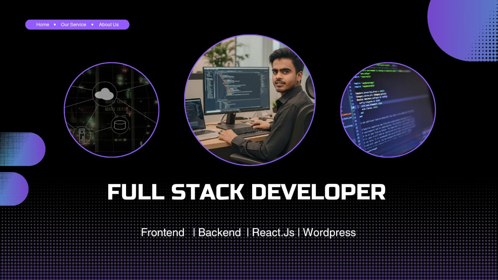

  

<h1 align="center">Hi 👋, I'm Erfan Hossen</h1>
<h3 align="center">A passionate Full-stack web developer Form Bangladesh</h3>

- 🔭 I’m currently working on **Laravel & E-commerce Projects**

- 🌱 I’m currently learning **React js**

- 👯 I’m looking to collaborate on **github**

- 🤝 I’m looking for help with **React Project**

- 👨‍💻 All of my projects are available at [https://github.com/devwithefran99](https://github.com/devwithefran99)

- 💬 Ask me about **Html,Css,laravel,jQuary**

- 📫 How to reach me **devwithefran99@gmail.com**

- ⚡ Fun fact **I love clean code & problem solving**

<h3 align="left">Languages and Tools:</h3>

            

### 🛠️ Skills

---

### 📌 Featured Projects
- 🛒 **Laravel E-commerce Website**
- ❤️ **Wishlist & Cart System**
- 🔐 **Authentication System**

---

### 📫 Contact Me
- 📧 Email: devwithefran99@gmail.com
- 💼 GitHub: [github.com/devwithefran99](https://github.com/devwithefran99)

---

⭐ *Feel free to check my repositories & give a star!*

